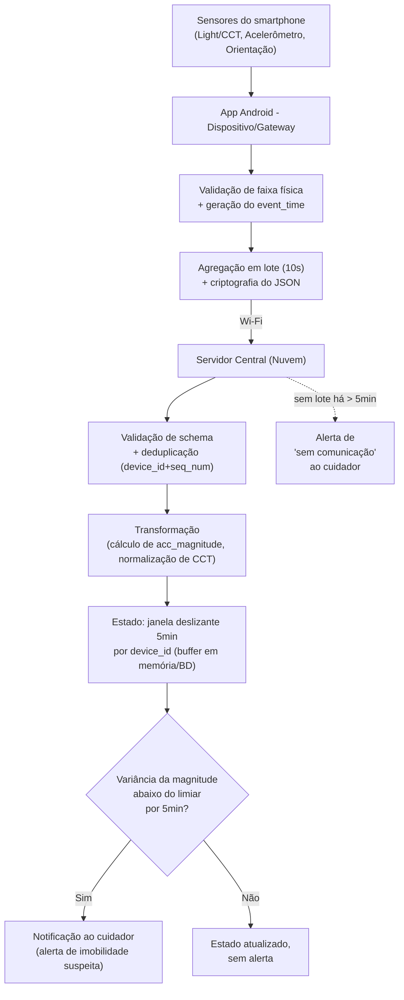

Atividade em Grupo 02 - Processamento e distribuição de responsabilidades
Cenário utilizado: Monitoramento e assistência a uma pessoa idosa (mesmo cenário da Atividade 01, incorporando o estado atual do protótipo descrito no README: smartphone Android como gateway, sensores de luz/CCT, acelerômetro e orientação, envio em lotes de 10s ao servidor central).
Integrantes: Deivison Oliveira Da Silva, Leonardo Cortes Filho, Mateus De Almeida Souza.

---
Parte 1 - Eventos do sistema
1 e 2. Tipos de evento e contrato
O smartphone do idoso (gateway) produz dois tipos de evento diferentes, embora venham do mesmo dispositivo: um sobre o ambiente (luz) e outro sobre o movimento do idoso.
Evento 1 — `LeituraAmbiente`
Campo do contrato	Valor
Nome	`LeituraAmbiente`
Produtor	App Android (sensor TCS3701 Light / CCT)
Entidade observada	O ambiente/cômodo onde o idoso está
Tempo do evento	Instante em que o sensor capturou a leitura no próprio dispositivo (não o instante de chegada ao servidor)
Campos	`device_id`, `event_time`, `luminosidade`, `cct`, `seq_num`
Unidade	luminosidade em lux; CCT em Kelvin
Identificador	`device_id` + `seq_num` (contador incremental por dispositivo)
Evento 2 — `LeituraMovimento`
Campo do contrato	Valor
Nome	`LeituraMovimento`
Produtor	App Android (acelerômetro LIS2DLC12 + sensores de orientação)
Entidade observada	O idoso (indiretamente, via movimento do dispositivo que ele carrega)
Tempo do evento	Instante da leitura do acelerômetro/orientação no dispositivo
Campos	`device_id`, `event_time`, `acc_x`, `acc_y`, `acc_z`, `acc_magnitude`, `orientacao`, `seq_num`
Unidade	aceleração em m/s²; orientação em graus
Identificador	`device_id` + `seq_num`
Os dois eventos são produzidos pelo mesmo smartphone (mesmo gateway), mas representam ocorrências diferentes: um descreve o ambiente físico ao redor do idoso, o outro descreve o comportamento/movimento do idoso.
3. Exemplos (JSON)
```json
{
  "tipo": "LeituraAmbiente",
  "device_id": "smartphone-idoso-01",
  "event_time": "2026-08-28T21:14:03.120-03:00",
  "luminosidade": 42.5,
  "cct": 6200,
  "seq_num": 18734
}
```
```json
{
  "tipo": "LeituraMovimento",
  "device_id": "smartphone-idoso-01",
  "event_time": "2026-08-28T21:14:03.450-03:00",
  "acc_x": 0.12,
  "acc_y": 9.71,
  "acc_z": 0.05,
  "acc_magnitude": 9.72,
  "orientacao": 88.4,
  "seq_num": 18735
}
```
4. Qualidade
Validação necessária: verificação de faixa física plausível — `acc_magnitude` deve estar entre 0 e ~30 m/s² (fora disso é ruído/erro de sensor); `cct` entre 1000K e 12000K; `luminosidade` ≥ 0 lux. Eventos fora da faixa são descartados na filtragem (item 5).
Evento inválido: campo obrigatório ausente, tipo de dado incorreto, ou valor fora da faixa física plausível descrita acima → descartado antes de entrar no processamento.
Evento duplicado: mesma combinação `device_id` + `seq_num` já processada anteriormente → descartado silenciosamente (idempotência), pois pode ocorrer reenvio em caso de falha de rede após o envio do lote.
Evento desatualizado (atrasado): `event_time` muito anterior ao tempo de processamento atual, além de um limite tolerável (ver item 8) → tratado conforme a política de atraso, não descartado automaticamente sem análise.
---
Parte 2 - Processamento temporal
5. Operações
```
Evento bruto (LeituraAmbiente ou LeituraMovimento)
        ↓
Validação (schema + faixa física plausível)
        ↓
Filtragem (descarta inválidos e duplicados por device_id+seq_num)
        ↓
Transformação (ex.: recalcular acc_magnitude a partir de x,y,z; normalizar cct)
        ↓
Agrupamento (por device_id, dentro da janela temporal)
        ↓
Agregação (média/variância da magnitude de aceleração e do cct na janela)
        ↓
Detecção (regra de imobilidade / regra de luz inadequada)
        ↓
Atuação (notificação ao cuidador, se a condição for confirmada)
```
6. Estado e janela
Regra escolhida: detecção de imobilidade prolongada (indício de possível queda ou mal-estar).
Tipo de janela: deslizante (sliding window) por `device_id`.
Duração: 5 minutos.
Frequência de avaliação: a cada novo lote de `LeituraMovimento` recebido (lotes chegam a cada ~10s, conforme o protótipo atual).
Estado mantido: para cada `device_id`, um buffer com os valores de `acc_magnitude` (e seus `event_time`) dos últimos 5 minutos, mais o `seq_num` do último evento processado (para detectar duplicados/atraso) e o timestamp da última leitura recebida (para o item 12).
A regra depende de eventos anteriores porque "imobilidade" só é definida em relação a uma janela de tempo — um único evento de baixa aceleração não indica nada por si só; é a ausência sustentada de variação ao longo da janela que caracteriza o padrão suspeito.
7. Semântica temporal
A regra usa tempo do evento (`event_time`, gerado no dispositivo), não o tempo de processamento (chegada ao servidor).
Justificativa: os dados chegam em lotes a cada 10s e podem sofrer atraso adicional por falha momentânea de rede. Se a janela fosse calculada pelo tempo de chegada ao servidor, uma interrupção de conectividade poderia distorcer a duração real do período de imobilidade observada (comprimindo ou espalhando artificialmente os eventos). Usar o tempo do evento garante que a janela de 5 minutos reflita o tempo real vivido pelo idoso, que é o que importa para decidir se há uma emergência.
8. Eventos atrasados
Como os dados são enviados em lotes de 10s e podem haver reenvios após perda de conectividade, um evento de uma janela já fechada pode chegar depois de o resultado ter sido produzido.
Política adotada — corrigir, com prazo de graça:
Se o evento atrasado chega dentro de até 2 minutos após o resultado da janela ter sido emitido, o sistema recalcula a janela com o dado adicional. Se a nova agregação alterar a decisão (ex.: havia sido detectada imobilidade, mas o evento atrasado mostra que houve movimento), o sistema emite uma correção (cancela o alerta enviado ao cuidador, ou marca o evento anterior como falso positivo no histórico).
Se o evento atrasado chega depois desse prazo, ele é separado: não reabre a decisão já tomada (não faz sentido cancelar um alerta de segurança minutos depois), mas é armazenado no histórico para fins de auditoria e ajuste futuro dos limiares da regra.
9. Pseudocódigo
```
ao receber evento e (tipo = LeituraMovimento):

    # 1. Validade dos dados
    se not (0 <= e.acc_magnitude <= 30):
        descartar(e, motivo="fora de faixa")
        retornar

    se ja_processado(e.device_id, e.seq_num):
        descartar(e, motivo="duplicado")
        retornar

    janela = buffer[e.device_id]  # estado mantido por dispositivo

    # 2. Tratamento de atraso
    se e.event_time < janela.tempo_fim_ultima_avaliacao:
        se (agora() - janela.tempo_fim_ultima_avaliacao) <= 2min:
            janela.inserir(e)
            resultado_novo = avaliar(janela)
            se resultado_novo != janela.ultimo_resultado:
                emitir_correcao(e.device_id, resultado_novo)
        senao:
            arquivar_para_auditoria(e)
        retornar

    # 3. Fluxo normal
    janela.inserir(e)
    janela.remover_eventos_mais_antigos_que(5min, referencia=e.event_time)

    # 4. Condição da regra (usa tempo do evento)
    variancia = calcular_variancia([x.acc_magnitude for x in janela.eventos])
    duracao_coberta = janela.evento_mais_recente.event_time - janela.evento_mais_antigo.event_time

    se duracao_coberta >= 5min e variancia < LIMIAR_IMOBILIDADE:
        decisao = "imobilidade_suspeita"
        atuar(notificar_cuidador, device_id=e.device_id, evento_gerador=e)
    senao:
        decisao = "normal"

    janela.ultimo_resultado = decisao
    janela.tempo_fim_ultima_avaliacao = e.event_time
```
---
Parte 3 - Distribuição e resiliência
10. Distribuição de responsabilidades
O sistema usa apenas dois níveis do contínuo: dispositivo e nuvem (servidor central). Não há um nível de borda/névoa físico separado — o próprio smartphone acumula esse papel de gateway.
Responsabilidade	Local de execução
Captura bruta dos sensores e geração do `event_time`	Dispositivo (smartphone)
Validação de faixa física + descarte de leituras claramente inválidas	Dispositivo (antes do envio, para reduzir tráfego)
Agregação em lote (10s), criptografia do JSON	Dispositivo
Deduplicação (`device_id` + `seq_num`)	Nuvem (servidor central)
Estado da janela deslizante (buffer de 5 min) por idoso	Nuvem
Detecção da regra de imobilidade / luz inadequada	Nuvem
Decisão de alertar o cuidador e disparo da notificação	Nuvem
Histórico/auditoria de eventos atrasados	Nuvem
11. Justificativas
Manter o estado da janela e a decisão na nuvem, não no dispositivo — critério: visão global e disponibilidade. O cuidador precisa acessar o status de fora da rede local do idoso, e futuramente um mesmo cuidador/profissional pode acompanhar mais de um idoso — isso exige um ponto central com visão consolidada. Além disso, manter o estado no servidor evita que a lógica de decisão dependa do app permanecer em primeiro plano no celular do idoso, o que aumenta a disponibilidade do serviço.
Executar a validação de faixa física no próprio dispositivo antes do envio — critério: volume de dados e energia. Descartar leituras claramente inválidas (ruído de sensor) localmente evita transmitir dados inúteis pela rede a cada 10s, economizando banda e bateria do idoso — recurso especialmente sensível nesse cenário, já que o dispositivo precisa durar o dia todo sem recarga.
12. Comportamento diante de falhas
Falha escolhida: dispositivo silencioso (interrupção de conectividade — nenhum lote chega ao servidor por um período).
Como o protocolo já é de lotes periódicos a cada 10s, o servidor mantém, por `device_id`, o timestamp do último lote recebido:
Se um lote não chega dentro do intervalo esperado (ex.: 2× o intervalo normal, 20s), o dispositivo é marcado internamente como "atraso leve" — sem gerar alerta ainda, pois pode ser apenas uma flutuação momentânea de rede.
Se a ausência de dados persistir além de um limite configurável (ex.: 5 minutos sem nenhum lote), o sistema não interpreta isso como imobilidade confirmada (já que não há dados novos para sustentar a regra da janela) — em vez disso, gera um alerta de prioridade diferente ao cuidador: "sem comunicação com o dispositivo do idoso há X minutos". Isso evita um falso positivo de queda por dado ausente, mas ainda assim informa o cuidador de que algo pode estar errado (bateria descarregada, dispositivo fora de alcance de Wi-Fi, etc.).
O buffer da janela é mantido, mas marcado como obsoleto (stale): ele não é usado para confirmar novas decisões de imobilidade até que dados frescos voltem a chegar, evitando decisões baseadas em estado desatualizado.
Quando a comunicação é restabelecida, o servidor retoma o processamento normal e, se aplicável, cancela o alerta de "sem comunicação".
13. Diagrama

