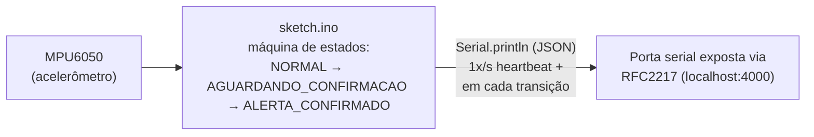
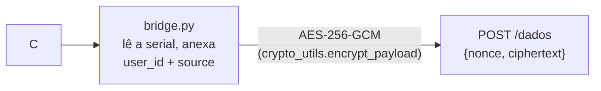
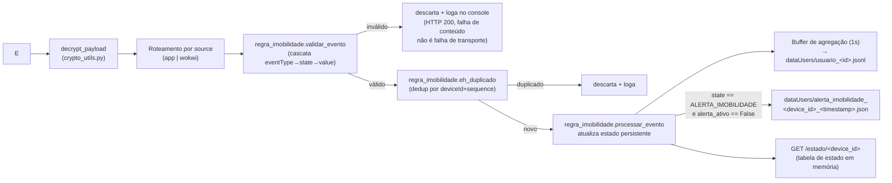

# Arquitetura da Integração — Marco 2

**Disciplina:** Software para Sistemas Ubíquos
**Cenário do projeto:** Monitoramento e assistência a uma pessoa idosa (ver `README.md` para a análise completa do sistema)

Este documento registra as decisões de arquitetura, o contrato e o comportamento do consumidor para a fronteira de integração validada neste marco, para consulta e apresentação a partir do próprio repositório — não é um relatório discursivo.

---

## 1. Escopo e fronteira

O objetivo do marco não é integrar o projeto inteiro, e sim validar **uma fronteira real** entre dois componentes: um produtor que emite eventos identificáveis e um consumidor que os recebe, valida e produz efeito observável.

**Fronteira escolhida:** Wokwi (ESP32 simulado + MPU6050, decisão de imobilidade) → `WokwiBridge/bridge.py` → `SensorServer/server.py` (consumidor).

A integração com o app Android (evento `leitura_ambiente`) fica **fora do escopo** deste documento, por decisão do grupo. No código, o mesmo servidor já recebe as duas fontes (o dispatcher por `source` em `server.py` trata `"app"` e `"wokwi"`), mas a fronteira demonstrada e detalhada aqui é apenas a do wokwi.

---

## 2. Diagrama de arquitetura

### Produtor



### Comunicação



### Consumidor



**Efeitos observáveis do consumidor** (item 4 do roteiro da apresentação): log (`dataUsers/usuario_<id>.jsonl`), mudança de estado (`GET /estado/<device_id>`) e atuação (`dataUsers/alerta_imobilidade_<device_id>_<timestamp>.json`).

---

## 3. Decisões de arquitetura

### 3.1 Produtor: quem emite o primeiro evento

O Wokwi (ESP32 simulado com MPU6050), via `sketch/sketch.ino`. Deriva do protótipo do Marco 1, reaproveitando: histerese de dois limiares (`LIMIAR_BAIXO`/`LIMIAR_ALTO`), persistência temporal (`T_PERSISTENCIA_MS`, `T_CONFIRMACAO_MS`), debounce nos botões, falha explícita (`LEITURA_INVALIDA`, `LEITURA_FORA_DE_FAIXA`) e logs estruturados via `Serial.println`.

Emite dois tipos de evento:

- **`imobilidade.leitura`** — heartbeat, 1x/s, reporta o estado atual da máquina e a magnitude lida.
- **`imobilidade.decisao`** — apenas em transições de estado (`SUSPEITA_IMOBILIDADE`, `CONFIRMADO_OK`, `MOVIMENTO_RETOMADO`, `ALERTA_IMOBILIDADE`, `REARMADO_MANUAL`, `LEITURA_INVALIDA`, `LEITURA_FORA_DE_FAIXA`).
Identificação única: `sequence` incremental por `deviceId`, compartilhado entre os dois tipos de evento (um único contador, não um por `eventType`).

### 3.2 Consumidor: quem consome e produz efeito observável

O servidor Flask único (`SensorServer/server.py`) recebe via `bridge.py`. Confere a identificação do evento (`user_id` + `source`), valida os eventos do wokwi em cascata (`SensorServer/regra_imobilidade.py`), mantém uma tabela de estado persistente por `deviceId`, agrega a leitura mais recente de cada fonte numa janela de 1 segundo (log combinado por usuário) e gera um artefato de alerta quando a decisão confirma imobilidade. Detalhes na seção 5.

### 3.3 Contrato mínimo e versionamento

Existe um envelope de **transporte** comum e cifrado (`{nonce, ciphertext}`, AES-256-GCM), igual para as duas fontes. Dentro do texto decifrado **não há** um envelope de aplicação unificado entre as fontes: `app` e `wokwi` mandam JSONs com formatos próprios, compartilhando apenas dois campos de roteamento — `user_id` (inteiro) e `source` (`"app"` ou `"wokwi"`). Ver seção 4 para o contrato completo do wokwi e a versão documentada.

### 3.4 Mecanismo de comunicação

HTTP, endpoint único (`POST /dados`), compartilhado pelas duas fontes, com um dispatcher interno por `source` (app vs. wokwi) e, dentro de `wokwi`, uma segunda cascata por `eventType`/`state` (seção 5.1).

**Por que HTTP e não MQTT/gRPC/Kafka:**

| Alternativa | Por que foi descartada |
| --- | --- |
| **MQTT** | Pede um broker publicador/assinante — útil quando há múltiplos consumidores independentes do mesmo evento. Aqui há um único consumidor (o servidor), então pub/sub não paga a infraestrutura extra (broker a manter, tópicos a versionar) sem ganho real neste estágio. |
| **gRPC** | Exige schema Protobuf compilado e gera acoplamento de build entre produtor e consumidor (o firmware ESP32 não tem, nem precisa de, um stack gRPC). O ganho de gRPC — streaming bidirecional eficiente, contratos fortemente tipados — não se justifica para um POST periódico e pequeno. |
| **Kafka** | Pensado para alto volume, múltiplos consumidores e retenção/replay de longo prazo — exige cluster de brokers. Aqui o volume é baixo e não há requisito de replay; seria infraestrutura desproporcional ao problema atual. |
| **HTTP (escolhido)** | É o "menor mecanismo que atende ao requisito": o produtor manda um evento pequeno por vez, sem sessão contínua nem handshake; o consumidor é único; a ação é explícita (ingestão de evento, não uma consulta). AES-GCM já cobre integridade/confidencialidade por mensagem, sem precisar de TLS/sessão — combina bem com um protocolo sem estado como HTTP. |

**Por que a resiliência é por substituição, e não por reenvio:** o evento carrega o estado físico observado de uma pessoa num instante — é telemetria de saúde, não um comando com efeito irreversível que exige entrega garantida (ver distinção telemetria × comando, seção 7). Reenviar um evento sobre um estado que já pode ter mudado não ajuda: na melhor hipótese é redundante — a leitura mais recente já reflete a situação atual assim que a conectividade volta —; na pior, um `ALERTA_IMOBILIDADE` entregue com atraso relevante pode confirmar, para o cuidador, um episódio que a própria pessoa já resolveu, gerando um alarme obsoleto exatamente no tipo de informação em que atraso vira informação errada. Por isso o sistema garante, em vez de reenviar eventos antigos, que a leitura mais recente sempre prevalece quando a conectividade volta. A condição de falha tratada nesta fronteira é a indisponibilidade da simulação, não a indisponibilidade do servidor: `bridge.py` reconecta automaticamente a porta serial a cada 3 segundos enquanto a simulação estiver fora do ar, e essa reconexão é o mecanismo observável e exercitável ao vivo (item 5 do roteiro de apresentação).

**Perguntas-guia respondidas:**

| Pergunta-guia | Resposta |
| --- | --- |
| Múltiplos consumidores? | Não — um único servidor consome. Pub/sub (MQTT) descartado por falta de necessidade. |
| Consulta ou ação explícita? | Ação explícita (ingestão de evento) → API baseada em recurso (HTTP), confirmado. |
| Precisa operar sem rede? | Sim, para a fonte de dados: `bridge.py` reconecta automaticamente a porta serial RFC2217 quando a simulação cai — é o retry exercitado ao vivo. Para o destino, a resiliência é por substituição, não por reenvio: uma falha de `POST` descarta o evento, e a leitura seguinte, mais recente, é o que prevalece (ver justificativa acima). |
| Comando produz consequência? | Sim, nos dois lados. O firmware evita reemitir o mesmo alerta enquanto a condição de imobilidade persistir (variável `alerta_ativo` em `sketch.ino`). O servidor, ao receber `imobilidade.decisao` com `state = ALERTA_IMOBILIDADE`, gera um artefato de alerta e mantém seu próprio flag `alerta_ativo` por `deviceId` — não confia cegamente no produtor para isso, mesmo que o firmware já se comporte assim. |

### 3.5 Responsabilidades da equipe

| Pessoa | Responsabilidade |
| --- | --- |
| Deivison | A construção e execução do simulador wokwi |
| Mateus | O funcionamento da bridge entre o wokwi (produtor) e o servidor (consumidor) |
| Leonardo | A construção e execução do servidor |

---

## 4. Contrato / Payload

### 4.1 Envelope de transporte (comum às duas fontes)

```json
{ "nonce": "<base64, 12 bytes>", "ciphertext": "<base64>" }
```

Cifrado com AES-256-GCM, chave simétrica pré-compartilhada (`SensorServer/crypto_utils.py`, idêntico a `WokwiBridge/crypto_utils.py`). GCM fornece integridade (tag de autenticação) além de confidencialidade — dispensa mecanismo adicional de assinatura para detectar adulteração em trânsito.

### 4.2 Payload de aplicação — wokwi

Após decifrado, o JSON emitido por `sketch.ino` e repassado por `bridge.py` (que apenas anexa `user_id` e `source`):

| Campo | Tipo | Descrição |
| --- | --- | --- |
| `eventType` | string | `"imobilidade.leitura"` (heartbeat) ou `"imobilidade.decisao"` (transição de estado) |
| `deviceId` | string | Identificador fixo do dispositivo (`"esp32-decisao-imobilidade-01"`) |
| `entityId` | string | Identificador da pessoa monitorada (`"idoso-simulado-01"`) |
| `eventTimeMs` | inteiro | Relógio interno do ESP32 (`millis()` desde o boot) — **não é timestamp absoluto** |
| `sequence` | inteiro | Contador incremental único por `deviceId`, compartilhado entre os dois `eventType` |
| `value` | número | Magnitude da aceleração (m/s²); `-1.0` é o sentinela de `LEITURA_INVALIDA` |
| `unit` | string | `"m/s2"` |
| `state` | string | Ver enum por `eventType` na seção 5.1 |
| `user_id` | inteiro | Anexado por `bridge.py` — identifica a pessoa dona do dispositivo, para agregação com o app |
| `source` | string | Anexado por `bridge.py` — sempre `"wokwi"` neste fluxo |

### 4.3 Versão do contrato

**Versão atual: v1** (definida por este documento — a lista de campos da seção 4.2, o vocabulário `EVENTOS_ESPERADOS` e a faixa de `value` em `regra_imobilidade.py`). O requisito do marco é que a versão esteja **identificada**, não que esteja embutida no payload em trânsito — por isso a decisão deliberada aqui é manter o payload do wokwi enxuto (sem metadado de versionamento) e tratar a versão como propriedade do *código publicado no repositório*, e não do dado que trafega. Rastrear a versão pelo commit/tag do repositório é suficiente para esta escala do protótipo.

**Política de versionamento (para quando o contrato crescer além de um único produtor/consumidor combinando código):**

- **Mudança compatível** (adicionar um `state` novo ao enum de `imobilidade.decisao`, por exemplo) — não exige subir a versão; produtor e consumidor continuam entendendo o payload um do outro, e o consumidor mais antigo simplesmente rejeita o `state` novo até ser atualizado (comportamento já existente na cascata da seção 5.1).
- **Mudança incompatível** (remover/renomear um campo, mudar o tipo de `value`, mudar a unidade de `eventTimeMs`) — é o gatilho para introduzir um campo `schemaVersion` no payload. Nesse ponto, produtor e consumidor deixam de poder assumir que estão sempre na mesma versão (por exemplo, se passarem a rodar em processos de deploy independentes, ou se um segundo tipo de dispositivo wokwi com firmware mais antigo continuar em campo), e a versão precisa viajar com o dado para o consumidor decidir como interpretá-lo — em vez de apenas rejeitar por não reconhecer os campos.
- Quando isso acontecer, o campo entra como `schemaVersion` (inteiro, incremental), verificado como primeiro passo da cascata de validação em `regra_imobilidade.py`, e a tabela da seção 4.2 e o diagrama da seção 2 devem ser atualizados junto.

Enquanto produtor e consumidor forem implantados juntos, a partir do mesmo commit — como é o caso hoje —, essa migração não é necessária: a versão documentada aqui já cumpre o requisito de "versão identificada".

---

## 5. Consumidor: validação, estado e efeito observável

### 5.1 Validação em cascata (`SensorServer/regra_imobilidade.py`, chamada por `server._processar_evento_wokwi`)

Antes de qualquer validação específica, `server.py` já exige `source ∈ {"app", "wokwi"}` e `user_id` inteiro (HTTP 400 fora disso). Para eventos do wokwi, a cascata roda em cima disso:

1. **Campos obrigatórios presentes** (`eventType`, `deviceId`, `entityId`, `eventTimeMs`, `sequence`, `value`, `unit`, `state`).
2. **`eventType` no vocabulário conhecido:** `{"imobilidade.leitura", "imobilidade.decisao"}`.
3. **`state` no enum esperado daquele `eventType`:**
   - `imobilidade.leitura` → `{NORMAL, AGUARDANDO_CONFIRMACAO, ALERTA_CONFIRMADO}`
   - `imobilidade.decisao` → `{LEITURA_INVALIDA, LEITURA_FORA_DE_FAIXA, SUSPEITA_IMOBILIDADE, CONFIRMADO_OK, MOVIMENTO_RETOMADO, ALERTA_IMOBILIDADE, REARMADO_MANUAL}`
4. **`value` dentro da faixa física plausível (0–30 m/s²)**, com duas exceções deliberadas e coerentes com o firmware: `LEITURA_INVALIDA` exige o sentinela `-1.0` (leitura falhou, não há magnitude real); `LEITURA_FORA_DE_FAIXA` exige `value > 30` (é o próprio evento que existe para reportar a anomalia — validar contra 0–30 rejeitaria o aviso).
5. **`sequence` maior que o último conhecido para aquele `deviceId`** (`eh_duplicado` — dedup/idempotência; `sequence` é global por dispositivo, não por `eventType`).
Evento que falha em qualquer passo é descartado e logado no console do servidor. A requisição HTTP ainda responde `200` — falha de conteúdo do evento não é tratada como falha de transporte.

### 5.2 Onde vive o estado e quem decide o quê

| Responsabilidade | Local | Observação |
| --- | --- | --- |
| Decisão de imobilidade (histerese, persistência, confirmação) | Produtor (`sketch.ino`) | O servidor não reimplementa a lógica de decisão — apenas reage ao `state` que chega |
| Validação de schema/vocabulário/faixa/dedup | Consumidor (`regra_imobilidade.validar_evento` / `eh_duplicado`) | Roda a cada evento, antes de qualquer persistência |
| Estado por dispositivo (`estado_atual`, `ultima_decisao`, `alerta_ativo`, `ultimo_sequence`) | Consumidor, em memória (`regra_imobilidade._estados: dict[deviceId, EstadoDispositivo]`) | Persiste **entre** janelas de agregação (não é limpo a cada flush de 1s); reinicia se o processo do servidor cair — aceito nesta fase de protótipo |
| Buffer de agregação app+wokwi (janela de 1s) | Consumidor, em memória (`server._buffer`) | Limpo a cada flush; não guarda histórico |
| Geração da atuação (alerta) | Consumidor (`server._processar_evento_wokwi`) | Só grava um novo arquivo se `alerta_ativo` estiver `False` para aquele `deviceId` |

### 5.3 Efeito observável (item 4 do roteiro)

- **Log:** `dataUsers/usuario_<user_id>.jsonl` — uma linha por janela de 1s, combinando a leitura mais recente de `app` e `wokwi` (fonte sem dado na janela fica `null`).
- **Mudança de estado:** `GET /estado/<device_id>` retorna a tabela de estado persistente (`estado_atual`, `ultima_decisao`, `alerta_ativo`, `ultimo_sequence`, `ultima_atualizacao`) — independente do log, não é limpa a cada 1s.
- **Atuação:** ao chegar `imobilidade.decisao` com `state = ALERTA_IMOBILIDADE` (e nenhum alerta já ativo para aquele `deviceId`), o servidor grava `dataUsers/alerta_imobilidade_<device_id>_<timestamp>.json`. `alerta_ativo` só volta a `False` quando chega `CONFIRMADO_OK`, `MOVIMENTO_RETOMADO` ou `REARMADO_MANUAL`.

---

## 6. Comportamento esperado diante de falha e repetição

| Cenário | Comportamento | Onde no código |
| --- | --- | --- |
| **Entrada muda** (`eventType`/`state` fora do vocabulário conhecido) | Evento rejeitado e descartado; log no console do servidor; HTTP responde `200` (não é falha de transporte) | `regra_imobilidade.validar_evento` |
| **Entrada falha** — servidor cai | `bridge.py` captura a exceção de conexão recusada, loga no console e segue lendo a próxima linha da serial — **não há reenvio** do evento perdido | `bridge.enviar_para_servidor` |
| **Entrada falha** — simulação Wokwi cai | `bridge.py` perde a conexão serial, entra em loop de reconexão a cada `RECONECTAR_A_CADA_S` (3s) até a simulação voltar — **retry real** | `bridge.conectar_serial` |
| **Entrada repete** (`sequence` já processado para aquele `deviceId`) | Evento descartado silenciosamente como duplicado (idempotência) | `regra_imobilidade.eh_duplicado` |
| **Autorização/identidade** | Não há autenticação por dispositivo — a chave AES é fixa e compartilhada entre todas as fontes (decisão de simplicidade documentada em `crypto_utils.py`); qualquer cliente com a chave pode enviar dados como qualquer `user_id`/`deviceId` | `SensorServer/crypto_utils.py`, `WokwiBridge/crypto_utils.py` |

---

## 7. Configuração necessária para rodar

| Componente | Configuração | Onde |
| --- | --- | --- |
| `SensorServer/server.py` | Porta HTTP (`PORT = 5000`), pasta de dados (`DATA_DIR = "dataUsers"`), janela de agregação (`JANELA_AGREGACAO_S = 1.0`) | Constantes no topo do arquivo |
| `SensorServer` / `WokwiBridge` | Chave AES-256 compartilhada (`SHARED_KEY_B64`) — precisa ser **idêntica** nos dois lados | `crypto_utils.py` (duplicado nos dois componentes) |
| `WokwiBridge/bridge.py` | URL da porta serial RFC2217 (`RFC2217_URL = "rfc2217://localhost:4000"`), URL do servidor (`SERVIDOR_URL`), `user_id` do wokwi (`WOKWI_USER_ID`) | Constantes no topo do arquivo |
| `sketch/wokwi.toml` | Porta RFC2217 exposta pela simulação (`rfc2217ServerPort = 4000`) | Arquivo de configuração do Wokwi |
| Dependências Python (servidor) | `Flask`, `cryptography` (ver `SensorServer/requirements.txt`) | `pip install -r SensorServer/requirements.txt` |
| Dependências Python (bridge) | `pyserial`, `requests`, `cryptography` (ver `WokwiBridge/requirements.txt`) | `pip install -r WokwiBridge/requirements.txt` |

---

## 8. Como executar

1. **Servidor:**

   ```bash
   cd SensorServer
   pip install -r requirements.txt
   python server.py
   ```

   Escuta em `0.0.0.0:5000`.

2. **Simulação Wokwi:** abrir a pasta `sketch/` no VS Code com a extensão Wokwi instalada, iniciar (`F1` → `Wokwi: Start Simulator`), manter a aba do simulador visível.

3. **Bridge:**

   ```bash
   cd WokwiBridge
   pip install -r requirements.txt
   python bridge.py
   ```

   Confirmar antes `WOKWI_USER_ID` e `SERVIDOR_URL` em `bridge.py`.

4. **Verificar a integração:**

   ```bash
   cat SensorServer/dataUsers/usuario_<WOKWI_USER_ID>.jsonl   # log por janela de 1s
   curl http://localhost:5000/estado/esp32-decisao-imobilidade-01   # estado persistente
   ls SensorServer/dataUsers/alerta_imobilidade_*.json         # atuação, se houve ALERTA_IMOBILIDADE
   ```

---

## 9. Pendências conhecidas (fora do escopo fechado deste marco)

- **Tabela de estado por usuário** (`estado_por_usuario[userId]`, agregando múltiplos dispositivos da mesma pessoa) — hoje o estado é por `deviceId`, não por `user_id`.
- **Autenticação por dispositivo** — chave AES fixa e compartilhada entre todas as fontes, sem rotação nem pareamento por dispositivo.
