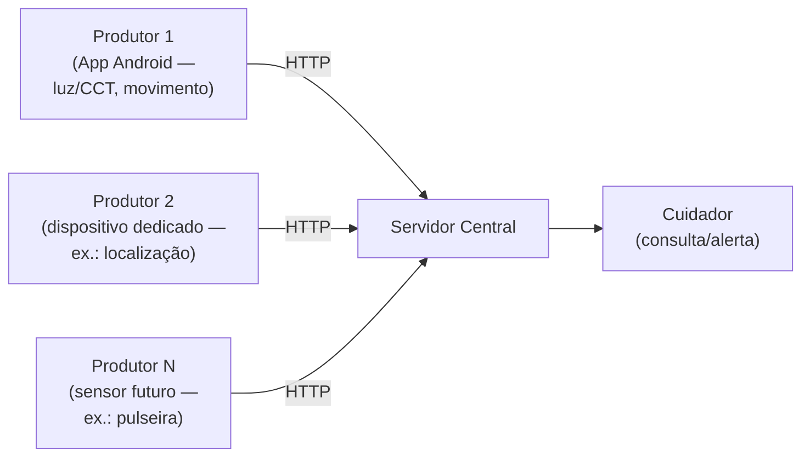

# Arquitetura Geral — Flow

**Disciplina:** Software para Sistemas Ubíquos
**Cenário do projeto:** Monitoramento e assistência a uma pessoa idosa (ver `README.md` para a análise inicial completa)

Este documento descreve a arquitetura **geral** do sistema Flow — a visão de componentes, contrato e decisões que valem independentemente de qual protótipo específico está em campo num dado momento.

---

## 1. Cenário e atores

- **Usuário primário:** a pessoa idosa monitorada — uso passivo, sem necessidade de interação direta.
- **Usuário secundário:** cuidadores e/ou familiares, que recebem informações e alertas.
- **Situação de uso:** ambiente residencial. Um ou mais dispositivos permanecem junto ao idoso ou no ambiente, coletando dados continuamente.

O sistema se caracteriza como **IoT** (dispositivos conectados enviando dados continuamente a um servidor) e como **aplicação ubíqua** (sensoriamento contínuo, sem interação explícita do idoso). Passa a se aproximar de um **sistema ciber-físico** a partir do momento em que a atuação (aviso ao cuidador, e futuramente outras ações) fecha o loop de percepção → decisão → efeito no mundo físico.

---

## 2. Visão geral dos componentes

| Elemento | Papel | Exemplos já identificados |
| --- | --- | --- |
| **Sensores** | Percebem o ambiente e o comportamento do idoso | Luz/CCT, acelerômetro, orientação, magnetômetro; futuramente localização e sinais vitais |
| **Produtor / gateway** | Concentra um ou mais sensores, monta o evento e o envia à rede | Smartphone Android (app); dispositivo dedicado (ESP32 ou similar) por sensor não coberto pelo celular (ex.: localização) |
| **Servidor central** | Recebe, valida, agrega e decide | Um único ponto lógico de consumo, com visão consolidada por pessoa monitorada |
| **Atuadores** | Produzem efeito observável a partir de uma decisão | Aviso ao cuidador (única ação definida até o momento); histórico consultável |

Cada pessoa monitorada pode ter **mais de um produtor simultâneo** (por exemplo, o celular para luz/movimento e um dispositivo dedicado para localização), todos identificados pelo mesmo `user_id` para que o servidor os trate como a mesma pessoa.

---

## 3. Topologia: estrela



Todos os produtores falam diretamente com o servidor central, por HTTP, sem nó intermediário. Essa é a decisão de topologia enquanto valer a premissa da seção 6: **um único consumidor lógico**, volume baixo por produtor, e nenhuma necessidade de um produtor consumir dados de outro produtor. A seção 9 avalia quando essa premissa deixa de valer e uma topologia em árvore passaria a compensar o custo extra.

---

## 4. Modelo de evento e contrato mínimo entre fontes

Todo produtor envia eventos dentro de um **envelope de transporte comum**, cifrado:

```json
{ "nonce": "<base64>", "ciphertext": "<base64>" }
```

Dentro do texto decifrado, dois campos de **roteamento** são obrigatórios e compartilhados por qualquer fonte:

| Campo | Tipo | Papel |
| --- | --- | --- |
| `schema_version` | inteiro | identifica a versão do schema usado pelo produtor |
| `user_id` | inteiro | Identifica a pessoa monitorada — permite ao servidor agregar dados de produtores diferentes como pertencentes ao mesmo idoso |
| `source` | string | Identifica de qual produtor o evento vem (ex.: `"app"`, `"wokwi"`, e futuramente outros) |

Fora desses três campos, **não existe um schema de aplicação unificado** entre fontes diferentes — cada produtor define seu próprio contrato (nome dos campos, unidades, identificador de evento). Isso é uma decisão deliberada: forçar um schema único entre um celular Android e um dispositivo dedicado de sensor acoplaria produtores que evoluem em ritmos e por equipes diferentes. O que o servidor exige de qualquer fonte nova é:

1. Um identificador de evento (nome do tipo de evento).
2. Um identificador de origem física (`device_id`) e um contador de sequência (`seq_num`/`sequence`) por dispositivo, para deduplicação/idempotência.
3. Um instante de leitura gerado na origem (tempo do evento, não tempo de chegada).

---

## 5. Mecanismo de comunicação: por que HTTP

| Alternativa | Por que foi descartada |
| --- | --- |
| **MQTT** | Pede um broker publicador/assinante — útil quando há múltiplos consumidores independentes do mesmo evento. Enquanto houver um único consumidor lógico (o servidor central), pub/sub não paga a infraestrutura extra (broker a manter, tópicos a versionar) sem ganho real. |
| **gRPC** | Exige schema Protobuf compilado e gera acoplamento de build entre produtor e consumidor — desproporcional para um POST periódico e pequeno partindo de firmware embarcado. |
| **Kafka** | Pensado para alto volume, múltiplos consumidores e retenção/replay de longo prazo, exigindo cluster de brokers. O volume por produtor aqui é baixo e não há requisito de replay. |
| **HTTP (escolhido)** | É o "menor mecanismo que atende ao requisito": evento pequeno, sem sessão contínua nem handshake; consumidor único; ação explícita (ingestão de evento). AES-GCM cobre integridade/confidencialidade por mensagem sem precisar de TLS/sessão — combina bem com um protocolo sem estado. |

**Perguntas-guia:**

| Pergunta-guia | Resposta |
| --- | --- |
| Múltiplos consumidores? | Não — um único servidor central consome. |
| Consulta ou ação explícita? | Ação explícita (ingestão de evento) → API baseada em recurso (HTTP). |
| Precisa operar sem rede? | Sim, do lado do produtor: cada gateway deve reconectar automaticamente à sua fonte de dados quando ela cai. Do lado do destino, a resiliência é por **substituição**, não por reenvio (seção 6). |
| Comando produz consequência? | Sim, dos dois lados — tanto o produtor quanto o servidor evitam reemitir/reprocessar o mesmo alerta enquanto a condição persistir; o servidor não confia cegamente no produtor para isso. |

Essa decisão vale enquanto a premissa "um único consumidor, volume baixo" se sustentar. A seção 9 avalia o cenário em que ela deixa de valer.

---

## 6. Processamento e resposta

Pipeline geral, independente da fonte:

```
Evento bruto
    ↓
Validação (schema + faixa física plausível)
    ↓
Deduplicação (device_id + sequência)
    ↓
Atualização de estado (por dispositivo e/ou por pessoa)
    ↓
Regra de decisão (ex.: luz inadequada à noite; imobilidade prolongada)
    ↓
Atuação (aviso ao cuidador), se a condição for confirmada
```

**Distribuição de responsabilidades** entre dispositivo e nuvem:

| Responsabilidade | Local | Critério |
| --- | --- | --- |
| Captura bruta e geração do tempo do evento | Dispositivo | O tempo que importa é o vivido pelo idoso, não o de chegada ao servidor |
| Descarte de leituras claramente inválidas (faixa física) | Dispositivo, antes do envio | Reduz tráfego e consumo de energia — recurso sensível em dispositivo que precisa durar o dia todo |
| Deduplicação, estado da janela, decisão da regra | Servidor central | Visão global e disponibilidade — o cuidador precisa acessar o status fora da rede local, e futuramente um mesmo cuidador pode acompanhar mais de uma pessoa; a decisão não pode depender do app permanecer em primeiro plano no dispositivo do idoso |
| Disparo da notificação e histórico/auditoria | Servidor central | Ponto único com visão consolidada |

Regras de negócio já identificadas: **luz inadequada à noite** (CCT frio no período noturno, com debounce) e **imobilidade prolongada** (baixa variância de aceleração sustentada por uma janela mínima). Novas regras seguem o mesmo pipeline.

---

## 7. Resiliência e falhas

O evento carrega o estado físico observado de uma pessoa num instante — é **telemetria**, não um comando com efeito irreversível que exige entrega garantida. Por isso:

- **Do produtor para o servidor:** se uma requisição falha, o evento é descartado, não reenviado. A leitura seguinte, mais recente, é o que prevalece — reenviar um estado que já pode ter mudado não ajuda: no melhor caso é redundante, no pior caso confirma para o cuidador um episódio que a pessoa já resolveu (alarme obsoleto).
- **Da fonte de dados para o produtor:** aqui sim há retry real — o gateway deve reconectar automaticamente à sua fonte (sensor/serial/etc.) enquanto ela estiver indisponível, porque essa é uma falha de disponibilidade da coleta, não do conteúdo do dado.
- **Dispositivo silencioso** (nenhum evento chega por um período): não deve ser interpretado como confirmação de imobilidade (não há dados novos sustentando a regra) — em vez disso, gera um alerta de prioridade diferente ("sem comunicação com o dispositivo há X minutos"), e o estado da janela é marcado como obsoleto até dados frescos voltarem.
- **Entrada inválida** (schema/vocabulário desconhecido): descartada e logada; não é tratada como falha de transporte — a requisição ainda responde com sucesso no nível HTTP.
- **Entrada repetida:** descartada silenciosamente via deduplicação por `device_id` + sequência (idempotência).

---

## 8. Segurança

O único mecanismo de segurança garantido hoje é a **cifragem do payload** (AES-256-GCM) entre produtor e servidor, que cobre confidencialidade e integridade por mensagem. Isso é tratado como o mínimo aceitável mesmo em produção: dados de movimento, luz e uso do dispositivo revelam rotina, hábitos e possíveis condições de saúde do idoso, então segurança no transporte e no armazenamento é o risco priorizado pelo grupo em relação a confiabilidade/completude dos dados e consumo de energia.

Numa arquitetura de produção — atendendo múltiplas pessoas monitoradas e múltiplos produtores por pessoa — isso implica, no mínimo:

- **Autenticação por dispositivo/produtor**, não uma chave única compartilhada por todo o sistema.
- **Controle de acesso** aos dados armazenados por pessoa monitorada (o cuidador de uma pessoa não deve acessar dados de outra).
- Um canal de comunicação autenticado entre produtor e servidor, além da cifragem do conteúdo.

O estado atual dessas três frentes — e por que a versão em campo hoje ainda não as implementa — está em `mudancas_arquitetura_prototipo.md`.

---

## 9. Alternativa avaliada: topologia em árvore (produtor → intermediário HTTP, intermediário → principal MQTT)

Cenário avaliado: em vez da estrela da seção 3, os nós produtores falam HTTP com um **nó intermediário** (um hub por residência/pessoa, agregando os produtores daquela pessoa), e os intermediários falam **MQTT** com o nó principal.

**Onde isso ganha da estrela atual:**

- **Fan-in do lado do principal.** Hoje há uma única pessoa monitorada; numa produção com muitas residências, cada uma potencialmente com vários produtores, MQTT dá ao nó principal uma única forma de assinar N tópicos (um por residência/pessoa) em vez de aceitar N×M conexões HTTP diretas. Sessões persistentes e QoS resolvem parte do "múltiplos produtores, um consumidor" que hoje justifica descartar MQTT — a justificativa da seção 5 ("um único consumidor, não paga a infraestrutura") deixa de valer quando o volume de residências cresce.
- **Detecção de nó fora do ar de graça.** O mecanismo *last will and testament* do MQTT notifica o principal quando um intermediário cai, sem precisar reimplementar o polling de "dispositivo silencioso" da seção 7 residência por residência.
- **Buffer local de fato.** O intermediário pode reter localmente os eventos das fontes daquela residência enquanto o principal estiver inacessível e escoá-los via MQTT (QoS 1/2) quando a conexão voltar — hoje essa resiliência simplesmente não existe entre produtor e servidor (a seção 7 descarta por decisão, não por limitação técnica, mas um buffer local seria uma opção adicional real).
- **Decisão local rápida.** Uma decisão de baixa latência (por exemplo, um aviso sonoro local) pode ser tomada no intermediário sem esperar o round-trip até o principal — hoje toda decisão depende do servidor central.

**Onde isso perde para a estrela atual:**

- **Componente novo por residência.** Um nó a mais para implantar, manter e proteger por pessoa monitorada — para o cenário de uma única pessoa monitorada (o estágio atual do projeto), isso é custo puro sem ganho, porque não há "vários produtores de várias residências" para agregar ainda.
- **Broker MQTT como infraestrutura nova.** É exatamente o argumento já usado na seção 5 para descartar MQTT na estrela: broker a manter, tópicos a versionar. Numa árvore, esse custo se paga pelo nó principal, mas ele não desaparece — só se justifica quando o número de intermediários for grande o bastante.
- **Duas superfícies de segurança em vez de uma.** HTTP+AES-GCM entre produtor e intermediário, e o modelo de autenticação/TLS do MQTT entre intermediário e principal — dois contratos e dois mecanismos de versionamento a manter em vez de um.
- **Ponto único de falha por residência.** Hoje, se o intermediário caísse, ele levaria consigo todos os produtores daquela pessoa, que antes falavam direto com o principal — uma perda de disponibilidade que não existe na estrela atual, em troca de reduzir carga no principal.

**Conclusão:** a árvore com HTTP/MQTT compensa quando o sistema deixa de ter "um consumidor, um produtor por vez" e passa a ter **muitas residências, cada uma com vários produtores** — exatamente o estágio de produção descrito na seção 1 (múltiplos idosos, múltiplos cuidadores). Na escala atual do protótipo (uma pessoa monitorada, poucos produtores, mesma rede local do servidor), o argumento que já descarta MQTT na estrela (seção 5) continua valendo, e a árvore adicionaria um nó e um protocolo novos sem um ganho correspondente. É uma evolução coerente para a "fase de crescimento" do projeto (seção 10), não para o estágio atual.

---

## 10. Fase de crescimento

Ideias observadas como caminhos futuros possíveis — nenhuma implementada nem com viabilidade averiguada:

- **Microfone**, para detecção de sons de queda ou pedidos de ajuda.
- **Contador de passos/giroscópio dedicado**, para refinar a detecção de atividade.
- **Localização** (dentro/fora de casa), para contextualizar a regra de imobilidade — terceira dimensão de contexto já identificada, exige permissão especial no Android e por isso está sendo validada separadamente antes de entrar no app real.
- **Pulseira com sensores de frequência cardíaca/oximetria** — dados mockados, já que o grupo não viabiliza compra de hardware real para o trabalho.
