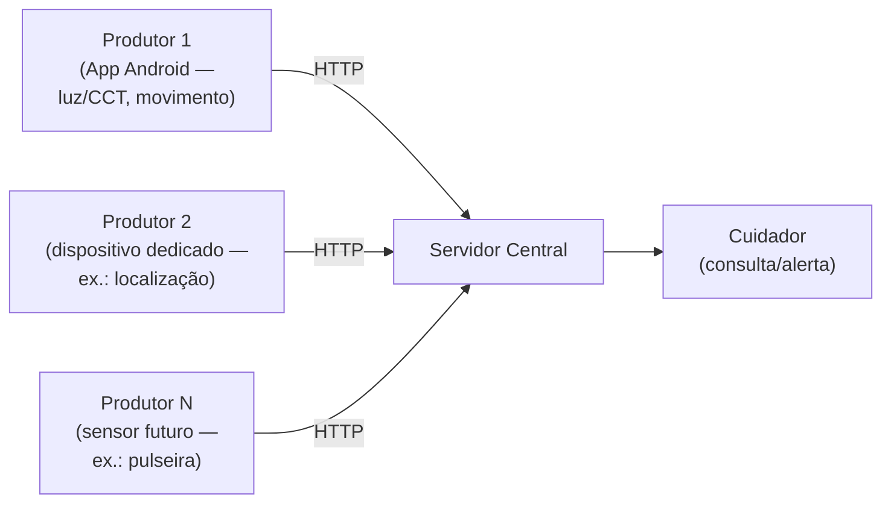

# Arquitetura Geral — Flow

**Disciplina:** Software para Sistemas Ubíquos
**Cenário do projeto:** Monitoramento e assistência a uma pessoa idosa (ver `README.md` para a análise inicial completa)

Este documento é o registro **único e versionável** das decisões de arquitetura do projeto Flow: os componentes envolvidos, o fluxo de comunicação entre eles, a responsabilidade de cada parte, o mecanismo de comunicação escolhido (e por que outros foram descartados) e as condições de falha já consideradas. Ele cobre tanto a visão **geral** (o que vale independentemente de qual protótipo está em campo) quanto o **estado atual do protótipo** (o que já está de fato implementado no código deste repositório), para que nenhuma decisão fique só na cabeça do grupo ou espalhada em anotações soltas.

---

## 1. Cenário e atores

- **Usuário primário:** a pessoa idosa monitorada — uso passivo, sem necessidade de interação direta.
- **Usuário secundário:** cuidadores e/ou familiares, que recebem informações e alertas.
- **Situação de uso:** ambiente residencial. Um ou mais dispositivos permanecem junto ao idoso ou no ambiente, coletando dados continuamente.

O sistema se caracteriza como **IoT** (dispositivos conectados enviando dados continuamente a um servidor) e como **aplicação ubíqua** (sensoriamento contínuo, sem interação explícita do idoso). Passa a se aproximar de um **sistema ciber-físico** a partir do momento em que a atuação (aviso ao cuidador, e futuramente outras ações) fecha o loop de percepção → decisão → efeito no mundo físico.

---

## 2. Visão geral dos componentes

| Elemento | Papel | Exemplos já identificados |
| --- | --- | --- |
| **Sensores** | Percebem o ambiente e o comportamento do idoso | Luz/CCT, acelerômetro, orientação, magnetômetro; futuramente localização e sinais vitais |
| **Produtor / gateway** | Concentra um ou mais sensores, monta o evento e o envia à rede | Smartphone Android (app); dispositivo dedicado (ESP32 ou similar) por sensor não coberto pelo celular (ex.: localização) |
| **Servidor central** | Recebe, valida, agrega e decide | Um único ponto lógico de consumo, com visão consolidada por pessoa monitorada |
| **Atuadores** | Produzem efeito observável a partir de uma decisão | Aviso ao cuidador (única ação definida até o momento); histórico consultável |

Cada pessoa monitorada pode ter **mais de um produtor simultâneo** (por exemplo, o celular para luz/movimento e um dispositivo dedicado para localização), todos identificados pelo mesmo `user_id` para que o servidor os trate como a mesma pessoa.

### 2.1 Componentes que existem hoje no repositório (implementação concreta)

| Pasta | Componente | Papel |
| --- | --- | --- |
| `SensorApp/` | App Android (Kotlin) — `MainActivity.kt` + `CryptoUtils.kt` | Produtor/gateway real: lê os sensores internos do celular, monta o JSON, cifra e envia via HTTP. |
| `SensorServer/` | Servidor central (Python/Flask) — `server.py`, `crypto_utils.py`, `regra_luz.py`, `regra_imobilidade.py` | Recebe os envelopes cifrados das duas fontes (app e wokwi), decifra, valida, deduplica, agrega, aplica as regras de decisão e grava os dados/alertas em disco. |
| `WokwiBridge/` | Ponte Python — `bridge.py`, `crypto_utils.py` (idêntico ao do servidor) | Segundo produtor: lê a serial do ESP32 simulado no Wokwi, anexa `user_id`/`source`, cifra e envia ao mesmo endpoint do servidor. |
| `sketch/` | Firmware ESP32 (`sketch.ino`, simulado via Wokwi) | Sensor + lógica de decisão/atuação local (histerese, persistência, confirmação humana), que gera os eventos que o `WokwiBridge` repassa. |

Ou seja: hoje existem **dois produtores reais** falando com o mesmo servidor — o app Android (sensores de luz/CCT e movimento do celular) e o par firmware ESP32 + `WokwiBridge` (acelerômetro simulado, com decisão de imobilidade já embarcada no próprio dispositivo).

---

## 3. Topologia: estrela



Todos os produtores falam diretamente com o servidor central, por HTTP, sem nó intermediário. Essa é a decisão de topologia enquanto valer a premissa da seção 6: **um único consumidor lógico**, volume baixo por produtor, e nenhuma necessidade de um produtor consumir dados de outro produtor. A seção 9 avalia quando essa premissa deixa de valer e uma topologia em árvore passaria a compensar o custo extra.

No protótipo atual essa estrela já é real, só que com dois raios em vez de N: `SensorApp` → `SensorServer` (HTTP direto) e `sketch.ino` → `WokwiBridge` → `SensorServer` (o bridge existe apenas porque o firmware simulado no Wokwi não fala HTTP diretamente — ele só imprime na serial —, não porque a arquitetura pede um nó intermediário; logicamente o bridge é parte do mesmo "produtor 2").

---

## 4. Modelo de evento e contrato mínimo entre fontes

Todo produtor envia eventos dentro de um **envelope de transporte comum**, cifrado:

```json
{ "nonce": "<base64>", "ciphertext": "<base64>" }
```

Dentro do texto decifrado, três campos de **roteamento** são obrigatórios e compartilhados por qualquer fonte:

| Campo | Tipo | Papel |
| --- | --- | --- |
| `schema_version` | inteiro | identifica a versão do schema usado pelo produtor |
| `user_id` | inteiro | Identifica a pessoa monitorada — permite ao servidor agregar dados de produtores diferentes como pertencentes ao mesmo idoso |
| `source` | string | Identifica de qual produtor o evento vem (ex.: `"app"`, `"wokwi"`, e futuramente outros) |

Fora desses três campos, **não existe um schema de aplicação unificado** entre fontes diferentes — cada produtor define seu próprio contrato (nome dos campos, unidades, identificador de evento). Isso é uma decisão deliberada: forçar um schema único entre um celular Android e um dispositivo dedicado de sensor acoplaria produtores que evoluem em ritmos e por equipes diferentes. O que o servidor exige de qualquer fonte nova é:

1. Um identificador de evento (nome do tipo de evento).
2. Um identificador de origem física (`device_id`) e um contador de sequência (`seq_num`/`sequence`) por dispositivo, para deduplicação/idempotência.
3. Um instante de leitura gerado na origem (tempo do evento, não tempo de chegada).

---

## 5. Mecanismo de comunicação: por que HTTP

| Alternativa | Por que foi descartada |
| --- | --- |
| **MQTT** | Pede um broker publicador/assinante — útil quando há múltiplos consumidores independentes do mesmo evento. Enquanto houver um único consumidor lógico (o servidor central), pub/sub não paga a infraestrutura extra (broker a manter, tópicos a versionar) sem ganho real. |
| **gRPC** | Exige schema Protobuf compilado e gera acoplamento de build entre produtor e consumidor — desproporcional para um POST periódico e pequeno partindo de firmware embarcado. |
| **Kafka** | Pensado para alto volume, múltiplos consumidores e retenção/replay de longo prazo, exigindo cluster de brokers. O volume por produtor aqui é baixo e não há requisito de replay. |
| **HTTP (escolhido)** | É o "menor mecanismo que atende ao requisito": evento pequeno, sem sessão contínua nem handshake; consumidor único; ação explícita (ingestão de evento). AES-GCM cobre integridade/confidencialidade por mensagem sem precisar de TLS/sessão — combina bem com um protocolo sem estado. |

**Perguntas-guia:**

| Pergunta-guia | Resposta |
| --- | --- |
| Múltiplos consumidores? | Não — um único servidor central consome. |
| Consulta ou ação explícita? | Ação explícita (ingestão de evento) → API baseada em recurso (HTTP). |
| Precisa operar sem rede? | Sim, do lado do produtor: cada gateway deve reconectar automaticamente à sua fonte de dados quando ela cai. Do lado do destino, a resiliência é por **substituição**, não por reenvio (seção 7). |
| Comando produz consequência? | Sim, dos dois lados — tanto o produtor quanto o servidor evitam reemitir/reprocessar o mesmo alerta enquanto a condição persistir; o servidor não confia cegamente no produtor para isso. |

Essa decisão vale enquanto a premissa "um único consumidor, volume baixo" se sustentar. A seção 9 avalia o cenário em que ela deixa de valer.

### 5.1 API concreta exposta pelo servidor (`SensorServer/server.py`, Flask)

| Rota | Método | Papel |
| --- | --- | --- |
| `/dados` | `POST` | Único ponto de ingestão de eventos, usado pelas duas fontes (`app` e `wokwi`). Recebe `{"nonce": ..., "ciphertext": ...}`. |
| `/dados` | `GET` | Debug: lista os últimos registros já agregados e gravados (pós-flush, ver seção 6.1). |
| `/estado/<device_id>` | `GET` | Expõe a tabela de estado persistente por dispositivo (a máquina de estados da imobilidade — ver seção 6.2), evidência observável de "mudança de estado" independente do log em disco. |
| `/health` | `GET` | Checagem simples de disponibilidade. |
| `/` | `GET` | Status simples (`{"status": "online"}`), usado pelo app/bridge para verificar se o servidor está de pé. |

O servidor escuta em `0.0.0.0:5000` (porta configurável em `PORT`), para aceitar conexões de outros dispositivos na mesma rede local — coerente com a decisão da seção 3 de que os produtores falam HTTP direto com o servidor, sem nó intermediário.

---

## 6. Processamento e resposta

Pipeline geral, independente da fonte:

```
Evento bruto
    ↓
Validação (schema + faixa física plausível)
    ↓
Deduplicação (device_id + sequência)
    ↓
Atualização de estado (por dispositivo e/ou por pessoa)
    ↓
Regra de decisão (ex.: luz inadequada à noite; imobilidade prolongada)
    ↓
Atuação (aviso ao cuidador), se a condição for confirmada
```

**Distribuição de responsabilidades** entre dispositivo e nuvem:

| Responsabilidade | Local | Critério |
| --- | --- | --- |
| Captura bruta e geração do tempo do evento | Dispositivo | O tempo que importa é o vivido pelo idoso, não o de chegada ao servidor |
| Descarte de leituras claramente inválidas (faixa física) | Dispositivo, antes do envio | Reduz tráfego e consumo de energia — recurso sensível em dispositivo que precisa durar o dia todo |
| Deduplicação, estado da janela, decisão da regra | Servidor central | Visão global e disponibilidade — o cuidador precisa acessar o status fora da rede local, e futuramente um mesmo cuidador pode acompanhar mais de uma pessoa; a decisão não pode depender do app permanecer em primeiro plano no dispositivo do idoso |
| Disparo da notificação e histórico/auditoria | Servidor central | Ponto único com visão consolidada |

Regras de negócio já identificadas: **luz inadequada à noite** (CCT frio no período noturno, com debounce) e **imobilidade prolongada** (baixa variância de aceleração sustentada por uma janela mínima). Novas regras seguem o mesmo pipeline.

### 6.1 Decisão: fila curta no servidor para correlacionar eventos de produtores diferentes do mesmo usuário

**Contexto:** um mesmo usuário pode ter mais de um produtor simultâneo — celular e um dispositivo dedicado/wearable (seção 2) —, cada um enviando de forma independente e assíncrona, sem nenhuma sincronização de relógio entre eles. Sem um mecanismo de correlação, dois eventos que na prática descrevem o mesmo instante da vida do idoso (ex.: o celular captando a luz do quarto e o wearable captando ausência de movimento) ficariam gravados como linhas soltas e desconexas — o cuidador (ou uma regra futura que precise de contexto combinado entre fontes) teria que correlacionar isso manualmente, por aproximação de horário.

**Decisão:** o servidor mantém, por `user_id`, uma **fila curta em memória** com a leitura mais recente de cada fonte (`app`/`wokwi`), e resolve essa fila periodicamente, num intervalo curto, consolidando as fontes daquele usuário numa única linha — mesmo que os eventos não tenham chegado no exato mesmo milissegundo. Essa janela funciona como uma tolerância deliberada para que eventos de dispositivos diferentes do mesmo usuário "ressoem" juntos (sejam tratados como pertencentes ao mesmo instante), sem exigir que os produtores enviem de forma sincronizada.

**Alternativas consideradas:**

| Alternativa | Por que foi descartada |
| --- | --- |
| Sem correlação — gravar cada evento isolado, sem juntar por usuário | Perde-se o contexto cruzado entre fontes do mesmo idoso; qualquer análise ou regra que dependa de mais de um sensor teria que reconstruir a correlação depois, fora do servidor. |
| Correlação por timestamp exato (join estrito entre fontes) | Eventos de produtores diferentes quase nunca chegam no mesmo instante exato (latência de rede, ciclos de leitura levemente distintos); um join estrito descartaria quase todos os pares, tornando a correlação inútil na prática. |
| Fila/janela longa (minutos), com correlação por proximidade temporal mais permissiva | Atrasa demais a disponibilidade do dado consolidado e complica a lógica de resolução; não combina com o objetivo de decisões quase em tempo real (regras de alerta da seção 6.2/6.3 não podem esperar minutos). |
| **Fila curta em memória, resolvida em janela fixa curta (escolhida)** | É o "menor mecanismo que resolve o problema": correlaciona fontes assíncronas dentro de uma tolerância pequena e previsível, sem a complexidade de um join temporal genérico, e sem exigir que os produtores sincronizem relógio ou horário de envio entre si. |

**Trade-off aceito:** se uma fonte atrasar além da janela, ela "perde" aquela consolidação e só aparece na resolução seguinte, sozinha (a chave da outra fonte fica ausente/nula naquela linha) — aceitável pelo mesmo critério da seção 7 (o evento é telemetria, não um comando que exige entrega garantida): a próxima consolidação, mais recente, é o que importa, não recuperar retroativamente um pareamento perdido.

#### 6.1.1 Implementação concreta desta decisão (`server.py`)

Como as duas fontes (app e wokwi) enviam de forma assíncrona e independente, a cada ~1 segundo, o servidor **não grava um arquivo por requisição**. Em vez disso:

1. Cada payload decifrado que chega é guardado na fila/buffer em memória descrita acima, indexado por `user_id`, sobrescrevendo a leitura mais recente daquela fonte (`app`/`wokwi`) dentro da janela atual — protegido por `threading.Lock` porque a thread de flush roda em paralelo com as requisições HTTP.
2. Uma **thread de fundo** dispara a cada `JANELA_AGREGACAO_S` (1 segundo) e, para cada usuário que recebeu qualquer dado desde o último disparo, grava **uma linha** em `dataUsers/usuario_<user_id>.jsonl`:

   ```json
   { "timestamp": "<hora do flush, ISO 8601>", "user_id": 1, "app": {...}|null, "wokwi": {...}|null }
   ```

   Se uma das fontes não mandou nada naquela janela, a chave dela fica `null` — **não repete o último valor conhecido**, para não maquiar ausência de dado como dado novo.

O fluxo de regra de negócio (seção 6.2/6.3) é **independente** desse buffer: é processado assim que o payload chega, sem esperar o flush de 1s, para não atrasar a detecção de uma condição de alerta.

### 6.2 Regra "luz inadequada à noite" (`regra_luz.py`, dados do app)

- **Validação:** campos obrigatórios presentes; `luminosidade >= 0`; `1000K <= cct <= 12000K`; `event_time` em ISO 8601 válido.
- **Deduplicação:** por `device_id` + `seq_num` (descarta se `seq_num` recebido não for maior que o último conhecido daquele dispositivo).
- **Condição:** horário noturno (18h–6h) **e** `cct > 4500K` (luz "fria").
- **Debounce:** exige **3 leituras consecutivas** com a condição presente antes de gerar o alerta (evita disparar por uma leitura isolada/ruído).
- **Não repetição:** uma vez que o alerta foi emitido para aquele episódio, o servidor não repete a cada novo ciclo enquanto a condição continuar — só volta a poder alertar depois que a condição deixar de estar presente (reset do contador) e se confirmar de novo.
- **Atuação:** grava um arquivo `alerta_<device_id>_<timestamp>.json` em `dataUsers/`.

### 6.3 Regra "imobilidade prolongada" (`regra_imobilidade.py` no servidor + máquina de estados em `sketch.ino`)

Aqui a decisão é **compartilhada entre dispositivo e servidor**, diferente da regra de luz (decisão só no servidor):

- **No dispositivo (`sketch.ino`):** uma máquina de estados de três estados (`NORMAL → AGUARDANDO_CONFIRMACAO → ALERTA_CONFIRMADO`) aplica histerese (dois limiares, `LIMIAR_BAIXO`/`LIMIAR_ALTO`), persistência mínima da condição (`T_PERSISTENCIA_MS`), uma janela de confirmação humana (`T_CONFIRMACAO_MS`, botão "estou bem") e rearme manual (botão) depois de um alerta confirmado. Cada transição emite um evento `imobilidade.decisao`; a cada ciclo (1x/s) também emite um heartbeat `imobilidade.leitura`.
- **No servidor:** valida em cascata (schema → `eventType` conhecido → `state` esperado para aquele `eventType` → faixa física plausível de `value`, com as exceções explícitas para os estados de leitura inválida/fora de faixa que o próprio firmware usa para *avisar* da anomalia), deduplica por `sequence` (contador único por dispositivo, compartilhado entre os dois tipos de evento), e mantém uma **tabela de estado persistente por `device_id`** — ao contrário do buffer da seção 6.1 (que é limpo a cada 1s), essa tabela persiste entre janelas e é o que fica exposto em `GET /estado/<device_id>`.
- **Atuação:** só quando chega `state == "ALERTA_IMOBILIDADE"` **e** o servidor ainda não tinha um alerta ativo para aquele episódio — o servidor não confia cegamente no firmware para não repetir; ele só rearma a flag quando recebe um dos estados que encerram o episódio (`CONFIRMADO_OK`, `MOVIMENTO_RETOMADO`, `REARMADO_MANUAL`). Quando confirma, grava `alerta_imobilidade_<device_id>_<timestamp>.json`.

Esse desenho deliberadamente decide a mesma condição em dois lugares (dispositivo decide "isto é um alerta" com toda a lógica de histerese/persistência/confirmação humana; servidor decide separadamente "devo atuar de novo ou este episódio já foi tratado") — o dispositivo tem contexto local de tempo real (baixa latência, útil para um LED/alarme local), o servidor tem visão de auditoria e é quem efetivamente aciona o cuidador.

---

## 7. Resiliência e falhas

O evento carrega o estado físico observado de uma pessoa num instante — é **telemetria**, não um comando com efeito irreversível que exige entrega garantida. Por isso:

- **Do produtor para o servidor:** se uma requisição falha, o evento é descartado, não reenviado. A leitura seguinte, mais recente, é o que prevalece — reenviar um estado que já pode ter mudado não ajuda: no melhor caso é redundante, no pior caso confirma para o cuidador um episódio que a pessoa já resolveu (alarme obsoleto). No app (`MainActivity.kt`), uma falha de rede (`onFailure`) só atualiza o texto de status na tela ("Servidor indisponível (tentando novamente)") — o próximo ciclo de envio, 1s depois, tenta de novo com dados frescos, sem fila de retransmissão.
- **Da fonte de dados para o produtor:** aqui sim há retry real — o gateway deve reconectar automaticamente à sua fonte (sensor/serial/etc.) enquanto ela estiver indisponível, porque essa é uma falha de disponibilidade da coleta, não do conteúdo do dado. Implementado concretamente em `WokwiBridge/bridge.py`: `conectar_serial()` fica tentando a cada `RECONECTAR_A_CADA_S` (3s) até a simulação estar de pé, e se a conexão cair no meio da leitura, reconecta e continua o loop, sem derrubar o processo.
- **Dispositivo silencioso** (nenhum evento chega por um período): não deve ser interpretado como confirmação de imobilidade (não há dados novos sustentando a regra) — em vez disso, gera um alerta de prioridade diferente ("sem comunicação com o dispositivo há X minutos"), e o estado da janela é marcado como obsoleto até dados frescos voltarem. **Status no protótipo:** essa política já é uma decisão registrada, mas o alerta específico de "sem comunicação" ainda não está implementado no código — hoje o campo `null` no `.jsonl` (seção 6.1) e o `ultima_atualizacao` na tabela de estado (seção 6.3) já dão a informação bruta para calcular isso, mas nenhuma rotina do servidor ainda dispara um alerta a partir dela.
- **Entrada inválida** (schema/vocabulário desconhecido): descartada e logada; não é tratada como falha de transporte — a requisição ainda responde com sucesso no nível HTTP (o `POST /dados` só retorna `4xx` para falha de decifração/parsing do envelope ou ausência dos campos de roteamento `source`/`user_id`; uma vez decifrado, um evento de aplicação inválido é descartado internamente e a resposta HTTP continua `200`).
- **Entrada repetida:** descartada silenciosamente via deduplicação por `device_id` + sequência (idempotência) — implementada de forma independente nas duas regras (seções 6.2 e 6.3), cada uma com seu próprio estado em memória por dispositivo.

---

## 8. Segurança

O único mecanismo de segurança garantido hoje é a **cifragem do payload** (AES-256-GCM) entre produtor e servidor, que cobre confidencialidade e integridade por mensagem. Isso é tratado como o mínimo aceitável mesmo em produção: dados de movimento, luz e uso do dispositivo revelam rotina, hábitos e possíveis condições de saúde do idoso, então segurança no transporte e no armazenamento é o risco priorizado pelo grupo em relação a confiabilidade/completude dos dados e consumo de energia.

### 8.1 Implementação concreta

- **Mecanismo:** AES-256-GCM, chave simétrica de 32 bytes, com nonce de 12 bytes gerado aleatoriamente a cada mensagem (`os.urandom`/`SecureRandom`) e tag de autenticação de 128 bits anexada ao final do ciphertext.
- **Onde roda:** duas implementações equivalentes e independentes — `SensorServer/crypto_utils.py`/`WokwiBridge/crypto_utils.py` (Python, `cryptography.hazmat`) e `SensorApp/.../CryptoUtils.kt` (Kotlin, `javax.crypto` nativo do Android, sem dependência extra). As duas produzem/consomem exatamente o mesmo formato de envelope.
- **Por que este mecanismo e não TLS/sessão:** é o "menor mecanismo que atende ao requisito" (mesmo critério da seção 5) — cada lote é cifrado e autenticado de forma independente (uma chamada = uma mensagem cifrada), o que combina com um protocolo sem estado de conexão como o HTTP simples já usado. GCM já fornece integridade (tag de autenticação), então não é necessário nenhum mecanismo adicional de assinatura para detectar adulteração do payload em trânsito.
- **Limitação assumida deliberadamente:** a chave (`SHARED_KEY_B64`) é **fixa, hardcoded e compartilhada** entre todos os produtores e o servidor, sem rotação nem troca de chaves (key exchange). Isso é aceitável apenas nesta fase de protótipo acadêmico, dentro da rede local — o código em ambos os lados documenta explicitamente essa limitação.

Numa arquitetura de produção — atendendo múltiplas pessoas monitoradas e múltiplos produtores por pessoa — isso implica, no mínimo:

- **Autenticação por dispositivo/produtor**, não uma chave única compartilhada por todo o sistema — por exemplo, cada celular gerando/recebendo sua própria chave num pareamento inicial (Diffie-Hellman/ECDH), ou uma chave por dispositivo emitida e armazenada de forma segura (Android Keystore), permitindo revogar/trocar a chave de um idoso específico sem afetar os demais.
- **Controle de acesso** aos dados armazenados por pessoa monitorada (o cuidador de uma pessoa não deve acessar dados de outra) — hoje os arquivos `dataUsers/usuario_<id>.jsonl` já são segregados por `user_id`, mas não há nenhuma camada de autenticação/autorização sobre quem pode lê-los.
- Um canal de comunicação autenticado entre produtor e servidor, além da cifragem do conteúdo — hoje qualquer cliente que souber a chave fixa e o IP:porta do servidor consegue enviar dados para qualquer `user_id`, já que não há autenticação de origem.

Essas três frentes são reconhecidas como necessárias, mas **nenhuma delas está implementada nesta fase** — o grupo optou por concentrar o esforço de segurança na cifragem do transporte, priorizando validar a viabilidade técnica do restante do sistema dentro do prazo da disciplina.

---

## 9. Alternativa avaliada: topologia em árvore (produtor → intermediário HTTP, intermediário → principal MQTT)

Cenário avaliado: em vez da estrela da seção 3, os nós produtores falam HTTP com um **nó intermediário** (um hub por residência/pessoa, agregando os produtores daquela pessoa), e os intermediários falam **MQTT** com o nó principal.

**Onde isso ganha da estrela atual:**

- **Fan-in do lado do principal.** Hoje há uma única pessoa monitorada; numa produção com muitas residências, cada uma potencialmente com vários produtores, MQTT dá ao nó principal uma única forma de assinar N tópicos (um por residência/pessoa) em vez de aceitar N×M conexões HTTP diretas. Sessões persistentes e QoS resolvem parte do "múltiplos produtores, um consumidor" que hoje justifica descartar MQTT — a justificativa da seção 5 ("um único consumidor, não paga a infraestrutura") deixa de valer quando o volume de residências cresce.
- **Detecção de nó fora do ar de graça.** O mecanismo *last will and testament* do MQTT notifica o principal quando um intermediário cai, sem precisar reimplementar o polling de "dispositivo silencioso" da seção 7 residência por residência.
- **Buffer local de fato.** O intermediário pode reter localmente os eventos das fontes daquela residência enquanto o principal estiver inacessível e escoá-los via MQTT (QoS 1/2) quando a conexão voltar — hoje essa resiliência simplesmente não existe entre produtor e servidor (a seção 7 descarta por decisão, não por limitação técnica, mas um buffer local seria uma opção adicional real).
- **Decisão local rápida.** Uma decisão de baixa latência (por exemplo, um aviso sonoro local) pode ser tomada no intermediário sem esperar o round-trip até o principal — hoje toda decisão depende do servidor central (com exceção parcial da regra de imobilidade, que já decide localmente no ESP32 antes de notificar o servidor, ver seção 6.3).

**Onde isso perde para a estrela atual:**

- **Componente novo por residência.** Um nó a mais para implantar, manter e proteger por pessoa monitorada — para o cenário de uma única pessoa monitorada (o estágio atual do projeto), isso é custo puro sem ganho, porque não há "vários produtores de várias residências" para agregar ainda.
- **Broker MQTT como infraestrutura nova.** É exatamente o argumento já usado na seção 5 para descartar MQTT na estrela: broker a manter, tópicos a versionar. Numa árvore, esse custo se paga pelo nó principal, mas ele não desaparece — só se justifica quando o número de intermediários for grande o bastante.
- **Duas superfícies de segurança em vez de uma.** HTTP+AES-GCM entre produtor e intermediário, e o modelo de autenticação/TLS do MQTT entre intermediário e principal — dois contratos e dois mecanismos de versionamento a manter em vez de um.
- **Ponto único de falha por residência.** Hoje, se o intermediário caísse, ele levaria consigo todos os produtores daquela pessoa, que antes falavam direto com o principal — uma perda de disponibilidade que não existe na estrela atual, em troca de reduzir carga no principal.

**Conclusão:** a árvore com HTTP/MQTT compensa quando o sistema deixa de ter "um consumidor, um produtor por vez" e passa a ter **muitas residências, cada uma com vários produtores** — exatamente o estágio de produção descrito na seção 1 (múltiplos idosos, múltiplos cuidadores). Na escala atual do protótipo (uma pessoa monitorada, poucos produtores, mesma rede local do servidor), o argumento que já descarta MQTT na estrela (seção 5) continua valendo, e a árvore adicionaria um nó e um protocolo novos sem um ganho correspondente. É uma evolução coerente para a "fase de crescimento" do projeto (seção 10), não para o estágio atual.

O `WokwiBridge` (seção 3) não é essa árvore: ele existe por uma limitação técnica pontual do simulador (o firmware só fala serial, não HTTP), não porque a arquitetura decidiu introduzir um nó intermediário lógico — o bridge só repassa 1:1, sem agregar múltiplos produtores nem falar um protocolo diferente do principal.

---

## 10. Fase de crescimento

Ideias observadas como caminhos futuros possíveis — nenhuma implementada nem com viabilidade averiguada:

- **Microfone**, para detecção de sons de queda ou pedidos de ajuda.
- **Contador de passos/giroscópio dedicado**, para refinar a detecção de atividade.
- **Localização** (dentro/fora de casa), para contextualizar a regra de imobilidade — terceira dimensão de contexto já identificada, exige permissão especial no Android e por isso está sendo validada separadamente antes de entrar no app real.
- **Pulseira com sensores de frequência cardíaca/oximetria** — dados mockados, já que o grupo não viabiliza compra de hardware real para o trabalho.

---

## 11. Estado atual do protótipo x arquitetura geral

Esta seção resume, decisão por decisão, o que já está implementado no código deste repositório e o que ainda é só decisão de projeto — para que o documento sirva como fonte única de verdade, sem depender de nenhum outro arquivo de notas.

| Decisão de arquitetura (seções 1–10) | Status no protótipo |
| --- | --- |
| Topologia em estrela, um único servidor central (seção 3) | **Implementado.** `SensorApp` e `sketch.ino`+`WokwiBridge` falam HTTP direto com `SensorServer/server.py`. |
| Múltiplos produtores identificados pelo mesmo `user_id` (seção 2) | **Implementado.** `user_id=1` configurado tanto no app (tela "Configurações") quanto no bridge (`WOKWI_USER_ID`); o servidor agrega os dois em `dataUsers/usuario_1.jsonl`. |
| Fila curta no servidor para correlacionar eventos de fontes diferentes do mesmo usuário (seção 6.1) | **Implementado.** Janela fixa de 1s (`JANELA_AGREGACAO_S`) resolve o buffer por `user_id` em uma linha consolidada por fonte. |
| Contrato mínimo comum (`schema_version`/`user_id`/`source`) + contrato livre por fonte (seção 4) | **Implementado**, com dois contratos concretos em produção: `leitura_ambiente` (app) e `imobilidade.*` (wokwi). |
| Versionamento de schema tolerante (seção 4.3) | **Implementado** nos dois lados (produtor sempre envia `schemaVersion=2`; servidor aceita ausência como versão 1, sem rejeitar). |
| HTTP como mecanismo de transporte (seção 5) | **Implementado.** Endpoint único `POST /dados`; demais rotas são debug/health. |
| Validação + faixa física plausível no dispositivo antes do envio (seção 6) | **Implementado** para CCT no app (`CCT_MIN/MAX_VALIDO`) e para a faixa 0–30 m/s² no firmware. |
| Deduplicação por `device_id`+sequência no servidor (seção 6) | **Implementado**, de forma independente nas duas regras (`regra_luz.py`, `regra_imobilidade.py`). |
| Regra "luz inadequada à noite" com debounce (seção 6) | **Implementado** (`regra_luz.py`). |
| Regra "imobilidade prolongada" com histerese/persistência/confirmação humana (seção 6) | **Implementado**, decisão dividida entre firmware (`sketch.ino`) e servidor (`regra_imobilidade.py`). |
| Atuação = aviso ao cuidador (seção 2) | **Parcialmente implementado.** Hoje a "atuação" é a gravação de um arquivo `alerta_*.json` em `dataUsers/` — ainda não existe um app/canal real de notificação para o cuidador (o fluxo `H -->|"Sim"| I["Notificação pop-up no celular do cuidador"]` do `README.md` é a visão de produto, não algo já implementado). |
| Resiliência por substituição (não reenvio) entre produtor e servidor (seção 7) | **Implementado** (app não enfileira nem reenvia em caso de falha). |
| Reconexão automática entre gateway e fonte de dados (seção 7) | **Implementado** no `WokwiBridge` (reconexão serial via RFC2217). |
| Alerta de "dispositivo silencioso" (seção 7) | **Decisão registrada, não implementada.** Os dados para calculá-lo já existem (`null` no `.jsonl`, `ultima_atualizacao` na tabela de estado), mas nenhuma rotina dispara esse alerta hoje. |
| Cifragem do payload (AES-256-GCM) (seção 8) | **Implementado**, nas duas pontas produtoras e no servidor. |
| Autenticação por dispositivo, controle de acesso, canal autenticado (seção 8) | **Não implementado.** Limitação conhecida e aceita apenas para esta fase acadêmica; chave simétrica única fixa no código. |
| Topologia em árvore com MQTT (seção 9) | **Não implementado — avaliado e descartado para o estágio atual**, candidato à fase de crescimento. |
| Sensores/dispositivos da fase de crescimento (seção 10) | **Não implementados** (ideias sem viabilidade averiguada). |

### 11.1 Como rodar cada componente (referência rápida, sem detalhar aqui o que já está no README de cada pasta)

- `SensorServer/`: `pip install -r requirements.txt && python server.py` — sobe o Flask em `0.0.0.0:5000` e a thread de agregação.
- `WokwiBridge/`: requer a simulação já rodando no Wokwi for VS Code (aba visível) e o `SensorServer` já de pé; `pip install -r requirements.txt && python bridge.py`.
- `SensorApp/`: build Android padrão (Gradle) ou uso do APK já publicado nas releases do repositório (ver `README.md`); IP/porta/`user_id` do servidor configurados na tela "Configurações" do app.

Este README de comandos é só uma referência de leitura — a decisão de arquitetura em si está nas seções 1–10 acima, e o item "não rodar o código" desta tarefa foi respeitado: nenhum desses comandos foi executado para produzir este documento, apenas o código-fonte foi lido.
